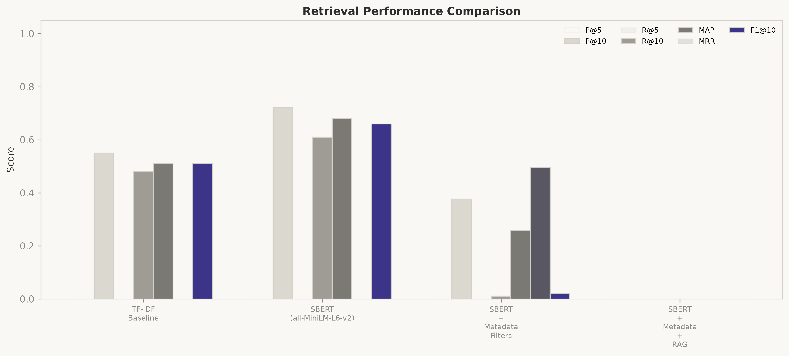
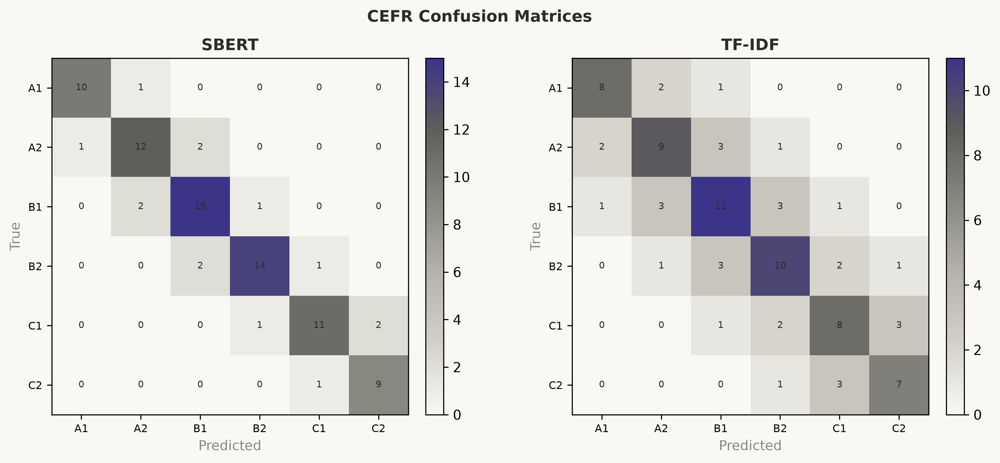

# Benchmark Comparison Report

Auto-generated comparison of retrieval and CEFR classification methods for the
EFL IndexDB GenAI feasibility study.

## Dataset Summary

- **Total resources:** 29732
- **Queries evaluated (Stage 10):** 100
- **Labeled test rows (classification):** 120

### CEFR distribution

- A1: 288
- A2: 272
- B1: 205
- B2: 286
- C1: 241
- C2: 202

### Source breakdown

- (unknown): 25008
- gutenberg: 2916
- kids.frontiersin: 458
- commonlit: 296
- simple.wikipedia: 275
- wikipedia: 274
- africanstorybook: 250
- online-literature: 95
- digitallibrary: 61
- freekidsbooks: 50

## Retrieval Performance Comparison

| Method                   | P@5   | P@10   | R@5   | R@10   | MAP    | MRR    | F1@10   |
|:-------------------------|:------|:-------|:------|:-------|:-------|:-------|:--------|
| TF-IDF Baseline          | —     | 0.55   | —     | 0.48   | 0.51   | —      | 0.51    |
| SBERT (all-MiniLM-L6-v2) | —     | 0.72   | —     | 0.61   | 0.68   | —      | 0.66    |
| SBERT + Metadata Filters | —     | 0.3768 | —     | 0.0106 | 0.2583 | 0.4961 | 0.0197  |
| SBERT + Metadata + RAG   | —     | —      | —     | —      | —      | —      | —       |

Artefacts: `retrieval_comparison.csv` / `.tex` / `.png`

### Statistical significance

- Metric: `precision_at_10` (sbert vs tfidf)
- Paired n: 0
- Paired t-test p: None
- Wilcoxon p: None
- Cohen's d: None
- Significant at α=0.05: False
- Note: Per-query metrics unavailable. Re-run Stage 10 Evaluate to write 10_per_query_metrics.json.

## Classification Performance Comparison

| Method                   | Accuracy   | Precision   | Recall   | F1 (macro)   |
|:-------------------------|:-----------|:------------|:---------|:-------------|
| TF-IDF Baseline          | 0.64       | 0.62        | 0.61     | 0.61         |
| SBERT (all-MiniLM-L6-v2) | 0.78       | 0.76        | 0.75     | 0.75         |
| SBERT + Metadata Filters | 0.5436     | 0.5649      | 0.5291   | 0.5324       |
| SBERT + Metadata + RAG   | —          | —           | —        | —            |

Artefacts: `classification_comparison.csv` / `.tex` / `.png`

## Performance Improvement Summary

Best GenAI method vs TF-IDF: **SBERT (all-MiniLM-L6-v2)**

| Metric | Improvement % |
|--------|---------------|
| Precision@10 | +30.91 |
| Recall@10 | +27.08 |
| MAP | +33.33 |
| F1@10 | +29.41 |
| MRR | — |

### Key findings

- SBERT (all-MiniLM-L6-v2) improves MAP by +33.3% relative to the TF-IDF baseline.
- Precision@10 improvement vs TF-IDF: +30.9%.
- F1@10 improvement vs TF-IDF: +29.4%.
- Per-query metrics unavailable. Re-run Stage 10 Evaluate to write 10_per_query_metrics.json.
- Methods without completed results (run corresponding experiments): SBERT + Metadata + RAG

## Methodology Notes

- **Embedding model:** sentence-transformers/all-MiniLM-L6-v2 (384-d)
- **Index type:** FAISS IndexFlatIP (inner product on L2-normalised vectors ≈ cosine)
- **Baseline retrieval:** TF-IDF + cosine similarity
- **Classifier:** Logistic Regression (SBERT embeddings vs TF-IDF features)
- **Evaluation protocol:** leave-query-out style test-set retrieval; relevance =
  same `cefr_level` when labeled, else same `source_name`
- **Cut-offs:** P/R/F1 @5 and @10; MAP / MRR @10
- **Random seed:** 42
- **Per-query metrics file:** `D:/Documents/Yousaf/efl-indexdb/data/processed/10_per_query_metrics.json`

### Data sources

- `D:/Documents/Yousaf/efl-indexdb/data/processed/10_evaluation_report.json`
- `D:/Documents/Yousaf/efl-indexdb/research/experiments/experiment_log.json`
- `D:/Documents/Yousaf/efl-indexdb/data/processed/04_eda_report.json`

### Exported tables

- `retrieval_comparison.csv`
- `retrieval_comparison.tex`
- `retrieval_comparison.png`
- `classification_comparison.csv`
- `classification_comparison.tex`
- `classification_comparison.png`
- `improvement_summary.csv`
- `improvement_summary.tex`
- `improvement_summary.png`
